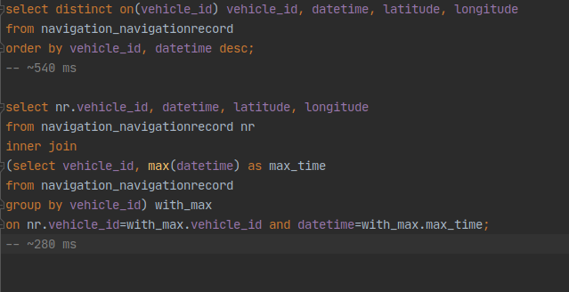
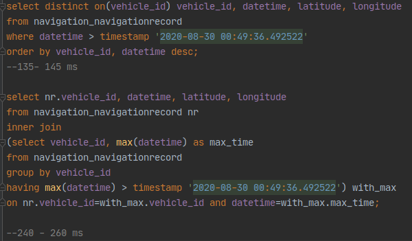

**Routes**

/api/latest/ All navigation records belonging to the past 48 hours.

/api/vehicle/ All vehicles saved in the database

/api/record/ All navigation records in the database

Project is configured to use a PostgreSQL database with the following
settings:

'NAME': 'postgredb',

'USER': 'cihat',

'PASSWORD': 'password'

**Creating the Query**

There are two prevailing ways to construct a query to fit our use case.

One is to use ‘distinct on’ feature of PostgreSQL, the other is fetching
the max with an aggregate function in a subquery and joining other
fields’ data on it.

To these I created a Postgre database and inserted some test data. I
inserted 16 cars and navigation record entries uniformly distributed in
the past month. Then I added 2 more cars that don’t have any navigation
entry in the past two days. In total this comes up to 861790 entries.

Here are the queries I run to get latest record for each time and the
amount of time it took for them to be executed.

In the screenshot above it seems second approach is superior in terms of
execution time.

However this changes when we filter for the time of last record:

Here it seems the distinct on function scales well with filters, while
the execution time for the approach using subquery barely changes at
all.

In addition while it is very difficult to create the second query in
Django ORM precisely, first query is fairly straightforward:

NavigationRecord.objects.filter(datetime\_\_gte=datetime.now() -
timedelta(days=2))\\

.order\_by('vehicle\_id', 'datetime').distinct('vehicle')

The only downside is that it can only be used with PostgreSQL.
