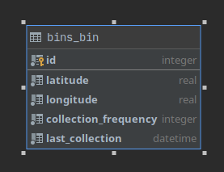
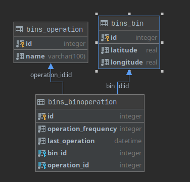

**Routes**

/api/bin/ All bins stored in the database

/api/operation/ All operations stored in the database

/api/binoperation/ All bin-operation records in the database. Includes
these fields: 'operation\_name', 'bin\_id', 'operation\_frequency',
'last\_operation', 'bin\_latitude', 'bin\_longitude'.

Project is currently configured to use db.sqlite3 as its database.

**Models and Migrations**

The image above shows the entity diagram of the models in the previous
version. As there was only a single operation, its frequency and last
operation time were stored in the bin table.

In the current version there can be more than operations. Therefore we
have a new operation table store what they are called, and binoperation
table to store each operation’s frequency and last operation time for
each bin.

To preserve data for collection time and frequency use the migration
called ‘separate\_operations’. This will create a new operation entry
for collection and a binoperation entry for each bin with collection’s
operation id.

To apply this migration run:

python manage.py migrate bins separate\_operations
